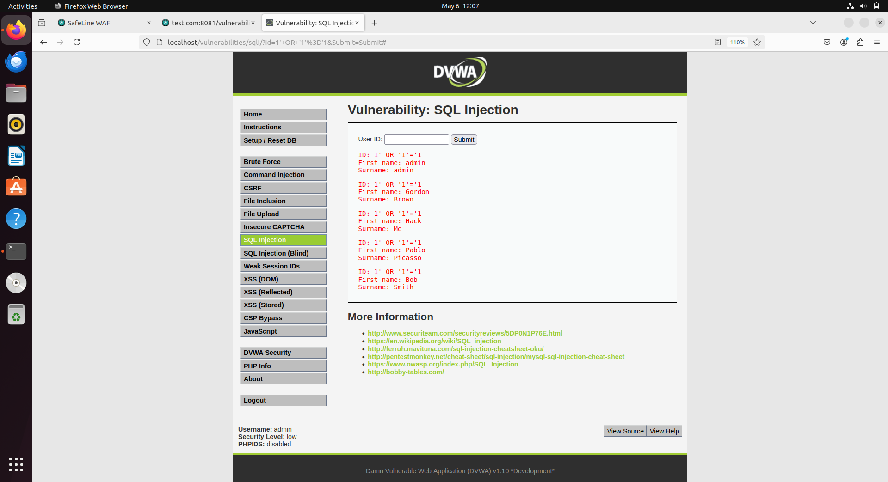
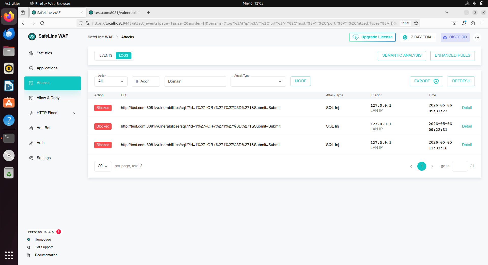
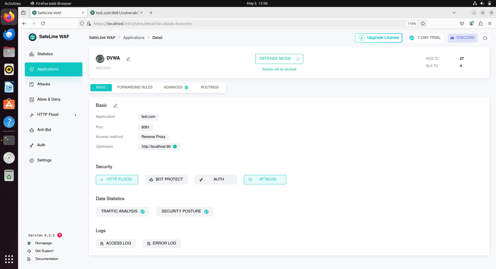
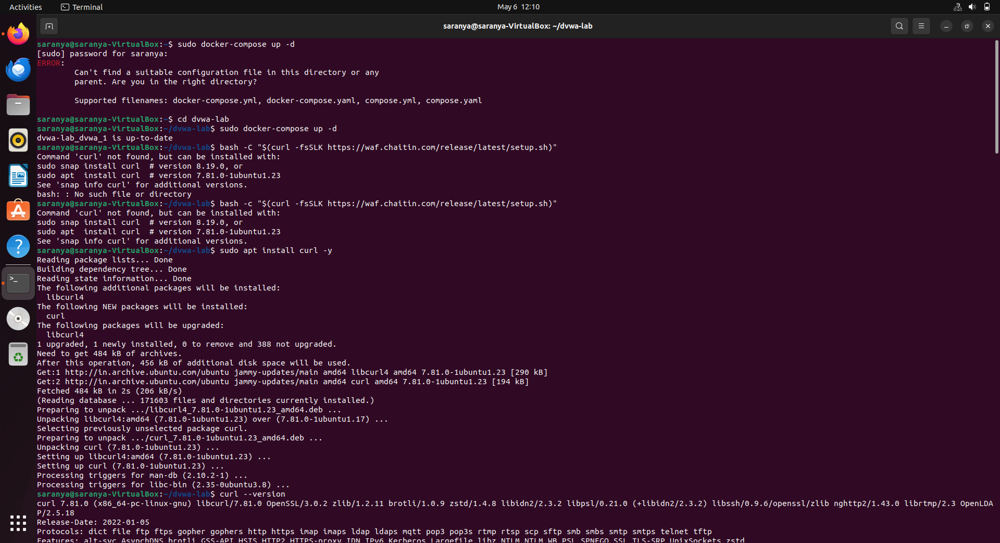
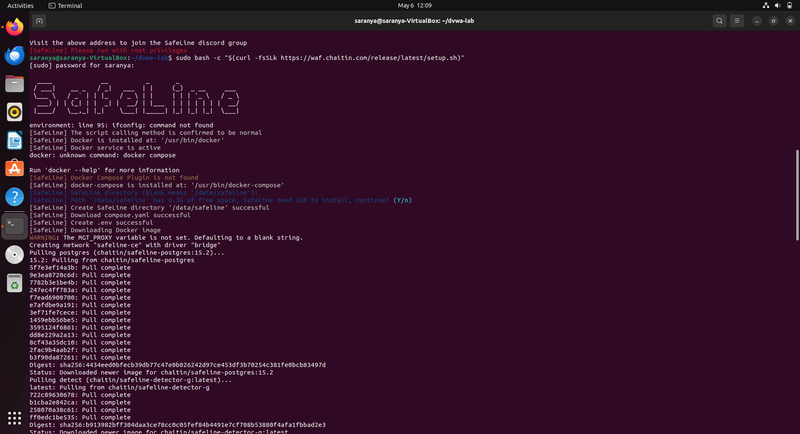
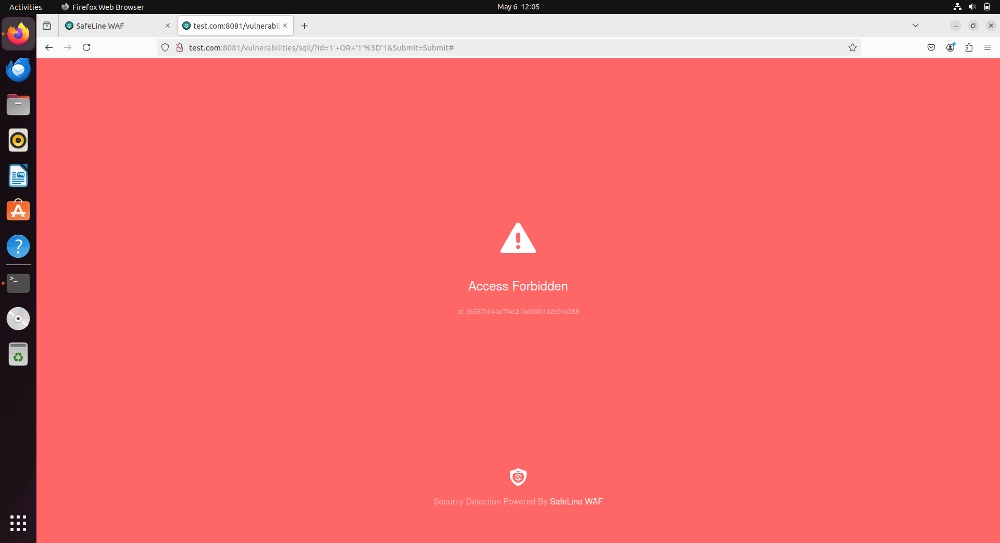

# WAF Lab using DVWA & SafeLine

## About This Project

In this project, I created a small cybersecurity lab to understand how web attacks work and how they can be stopped.

I used a vulnerable website (**DVWA**) to perform an attack (SQL Injection), and then used a Web Application Firewall (**SafeLine WAF**) to block that attack.

This helped me learn both sides:
    how attackers exploit systems
    how we can defend against them

## Tools Used

* Ubuntu (Virtual Machine)
* Docker & Docker Compose
* DVWA (Damn Vulnerable Web Application)
* SafeLine WAF

## Setup (Simple Overview)

### 1. Created Virtual Machine

* Installed Ubuntu using VirtualBox
* Set up a host-only network (for safety)

### 2. Installed Docker

//bash
sudo apt update
sudo apt install -y docker.io docker-compose

### 3. Ran DVWA

//bash
mkdir dvwa-lab && cd dvwa-lab
sudo docker-compose up -d

* Opened in browser: http://localhost:80
* Login:

  * Username: admin
  * Password: password

## SQL Injection Test

First, I tested normal input:
1

Then I tried a malicious input:
1' OR '1'='1

### What happened?

* The website returned all user data 
* This means the application is vulnerable to SQL Injection

### Screenshot

## Adding WAF Protection

I installed SafeLine WAF and connected it to the DVWA site.

* Dashboard: https://localhost:9443

## Testing Again (After WAF)

I repeated the same SQL Injection attack.

### Result:

* The request was blocked 
* WAF detected it as a malicious input

### Screenshot

## Rate Limiting

I also added a rule:

* Maximum **20 requests per second per IP**

This helps prevent:

* bots
* brute force attacks
* too many rapid requests

## Screenshots

### DVWA Page

### Docker Running

### WAF Setup

### Block Page

---

## What I Learned

* How SQL Injection works
* How vulnerable apps can be exploited
* How a WAF detects and blocks attacks
* Basics of Docker setup
* Importance of securing web applications

## Simple Flow

Without WAF:
User → Website → Attack succeeds ❌

With WAF:
User → WAF → Attack blocked → Safe ✅

## Conclusion

This project helped me understand real-world web security in a practical way.
It shows how important it is to protect applications from common attacks like SQL Injection.

